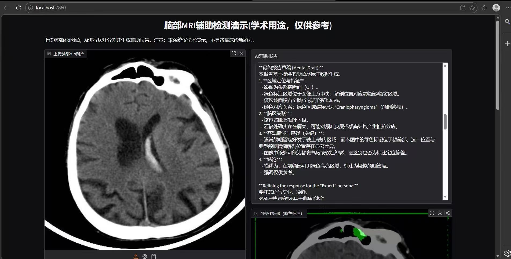
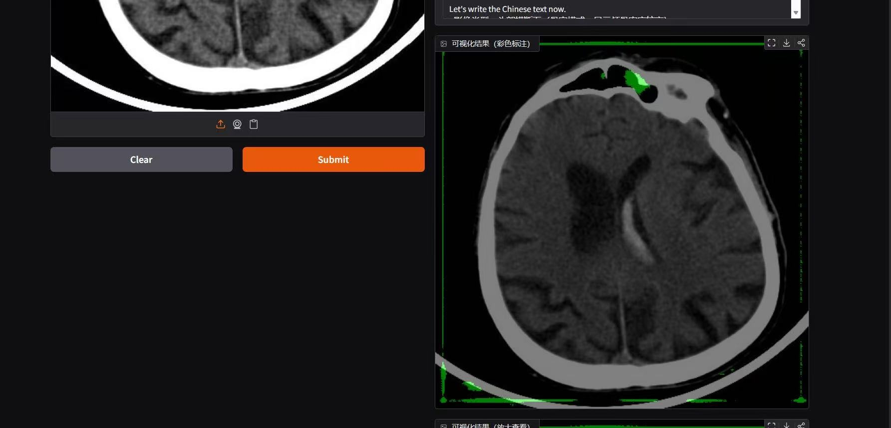

# BrainDetect — 脑瘤 AI 辅助检测与报告生成系统

基于改进 UNet 分割模型 + 大语言模型的脑瘤辅助检测系统。通过注意力增强的 UNet 实现 MRI 图像的多类病灶分割，结合 Qwen3.5-9B / Huatuo 医疗 LoRA 微调模型自动生成结构化辅助诊断报告。

## 系统流程

```
用户上传脑部 MRI 图像
        ↓
┌───────────────────────┐
│ UNet-Attention-DSConv │ ← 多类病灶实例分割
│  (注意力模块 + DSConv) │
└───────────┬───────────┘
            ↓
    分割结果 + 彩色可视化
            ↓
┌───────────────────────┐
│  LangChain Pipeline   │ ← 结构化提示词构建
└───────────┬───────────┘
            ↓
┌───────────────────────┐
│ vLLM (Qwen3.5 + Huatuo│ ← 医疗大模型推理
│  QLoRA 微调)           │
└───────────┬───────────┘
            ↓
┌───────────────────────┐
│   Gradio 前端展示      │ ← 原图 + 分割可视化 + 诊断报告
└───────────────────────┘
```

## 技术栈

| 组件 | 技术 | 说明 |
|------|------|------|
| 分割模型 | UNet + Attention + DSConv | 注意力模块提升分割精度，DSConv 减少参数量 |
| 大模型 | Qwen3.5-9B + Huatuo QLoRA | 医疗领域微调，降低幻觉风险 |
| 模型部署 | vLLM | 高性能推理服务 |
| 编排框架 | LangChain | 结构化 Prompt Pipeline |
| 前端 | Gradio | 交互式 Web 界面 |
| 后端 | FastAPI | API 服务 |
| 数据标注 | Roboflow | COCO 格式标注 + 掩码转换 |
| 损失函数 | CrossEntropy + Dice | 混合损失提升分割效果 |

## 模型说明

### UNet-Attention-DSConv

在经典 UNet 基础上做了两项改进：

1. **注意力模块**: 在编解码器之间加入注意力机制，提升模型对病灶区域的关注度
2. **DSConv（深度可分离卷积）**: 替换标准卷积层，大幅减少模型参数量（参见 `use_dsconv.png`）

训练数据：脑部 MRI 多类病灶分割数据集（Roboflow COCO 格式）
预训练权重：`unet/model_save/unet_atten_dsconv_best.pth`

### Qwen3.5 + Huatuo QLoRA

基于 Qwen3.5-9B 基础模型，使用 Huatuo 医疗数据集进行 QLoRA 微调，具备医疗文本理解和报告生成能力。

## 快速开始

### 1. 部署大模型

```bash
vllm serve /data/qwen3.5_9b_huatuo \
  --max-model-len 8192 \
  --tensor-parallel-size 2 \
  --gpu-memory-utilization 0.8 \
  --host 0.0.0.0
```

### 2. 安装依赖

```bash
pip install -r requirements.text
```

### 3. 启动 Gradio 演示

```bash
cd demo_gradio
python demo.py
```

### 4. 启动 FastAPI 后端

```bash
cd backend
python main.py
```

## 项目结构

```
BrainDetect-huatuo_qwen3.5/
├── backend/
│   └── main.py                    # FastAPI 后端入口
├── demo_gradio/
│   └── demo.py                    # Gradio 演示界面
├── langchain_pipeline/
│   └── chain.py                   # LangChain Prompt Pipeline
├── unet/
│   ├── model.py                   # UNet-Attention-DSConv 模型定义
│   ├── dataset.py                 # 数据集加载
│   ├── train.py                   # 模型训练
│   ├── inference.py               # 推理脚本
│   ├── utils.py                   # 工具函数
│   ├── model_save/                # 预训练权重
│   └── inference_jpg/             # 推理结果示例
├── qwen3.5_huatuo_lora模块/
│   └── main.py                    # Huatuo QLoRA 微调脚本
├── preprocess/
│   ├── coco_to_mask.py            # COCO 标注转掩码
│   └── downloaddata.ipynb         # 数据下载 Notebook
├── demo_test/                     # 测试用 MRI 样本
├── try_time/                      # 实验结果与可视化
├── use_dsconv.png                 # DSConv 参数对比图
└── requirements.text              # Python 依赖
```

## 数据处理

原始数据来自 Roboflow，格式为 COCO 标注。预处理流程：

1. `preprocess/downloaddata.ipynb` — 下载数据集
2. `preprocess/coco_to_mask.py` — COCO JSON → 分割掩码
3. 数据增强 + 训练/验证集划分

## 演示效果

**Gradio 界面截图 1：**



**Gradio 界面截图 2：**



## 核心特性

- **改进 UNet**: Attention 模块 + DSConv，兼顾精度与效率
- **混合损失**: CrossEntropy + Dice Loss，应对类别不平衡
- **医疗大模型**: Huatuo 数据集 QLoRA 微调，专业医疗文本生成
- **面积统计**: 自动计算病灶面积占比，减少模型幻觉
- **端到端**: 从图像输入到结构化报告输出的完整流水线
- **可视化**: 分割结果彩色叠加显示，直观展示病灶位置
